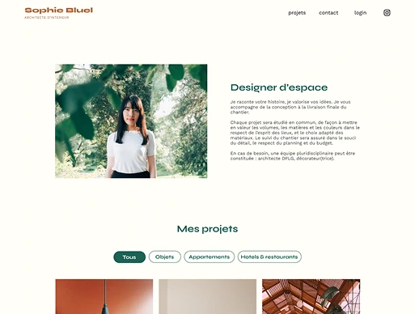
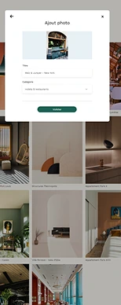

# Projet OC 3 - Sophie Bluel

<i>Travail réalisé lors de la formation "Développeur Web" d'OpenClassrooms.<br>
Base du code visible sur la branche Starter-code ou disponible [ICI](https://github.com/OpenClassrooms-Student-Center/Portfolio-architecte-sophie-bluel)
</i>


<p align="center">
  
  
</p>


## 🎞️ Scénario

<i>Vous travaillez comme développeuse front-end pour l’agence ArchiWebos, composée de 50 salariés. Après avoir terminé un projet en avance, vous êtes envoyée en renfort sur la conception du site portfolio de Sophie Bluel, architecte d'intérieur. Votre mission : développer la page de présentation des travaux de l'architecte, la page de connexion pour l'administrateur du site, et une modale pour uploader de nouveaux médias.</i>
<br><br>

## 🎯 Objectifs
- Récupérer les données utilisateurs dans le JavaScript via des formulaires.
- Gérer les événements utilisateurs avec JavaScript.
- Manipuler les éléments du DOM avec JavaScript.
<br><br>

## 💡 Technologies utilisées
- HTML5
- CSS3
- JavaScript
<br><br>


## 📂 Structure

📁 OC_P3_Portfolio-S-BLUEL/ │── 📁 Frontend/ │── 📁 assets/ │── 📁 scripts/ │── index.html │── login.html │── README.md
<br><br>

## 🚀 Installation
1. **Cloner** le dépôt GitHub :
   ```bash
   git clone https://github.com/HeleneC-cyber/OC_P3_Portfolio-S-BLUEL.git
2. **Naviguer** dans le répertoire du projet :
   ```bash
   cd OC_P3_Portfolio-S-BLUEL
3. **Ouvrir** le fichier index.html dans votre navigateur.
<br><br>


## 📝 Notes additionnelles
- Ce projet m'a permis d'appréhender la logique JavaScript et les interactions avec une API.
- La gestion dynamique de la modale avec ses deux vues a représenté un challenge particulier.
- Toute modification dans la galerie est immédiatement visible sans rechargement de page.
<br><br>


## 📬 Contact

Pour toute question ou suggestion, n'hésitez pas à me contacter sur [LinkedIn](https://www.linkedin.com/in/helene-canovas-48710b141/)

